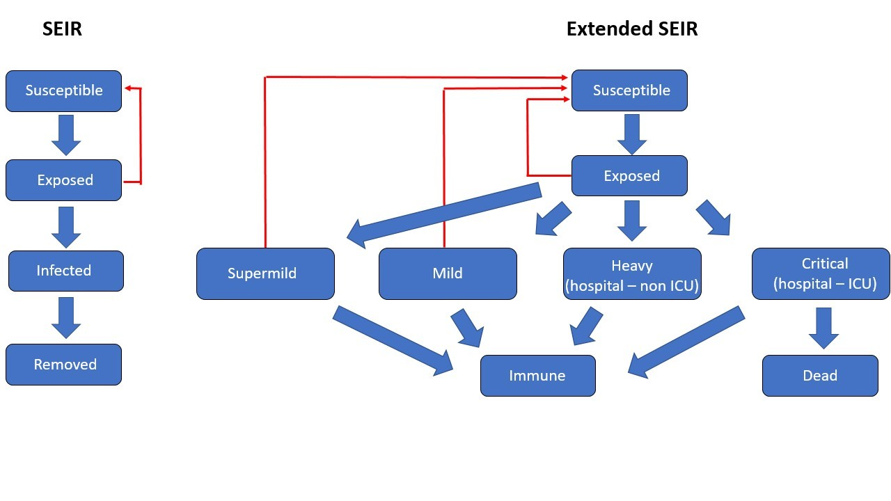
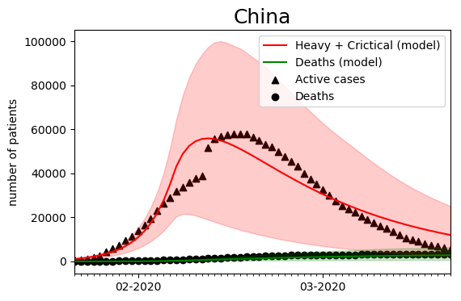

# COVID19-Model
SEIR model with scenario analysis and model-based predictive control to simulate the effect policies

This is the code for the [article, Covid-19: from model prediction to model predictive control,](https://www.linkedin.com/pulse/covid-19-from-model-prediction-predictive-control-ingmar-nopens/?trackingId=4P5ydm8bSOmyUBkRFNRWxw%3D%3D) published on LinkedIn by our group

## Highlight of the model

### SEIR
We use an extension of the SEIR model as demonstrated in the figure below. This model splits the population into different categories, i.e. susceptible, exposed, infected and removed. The latter 2 categories are further broken down in super mild, mild, heavy and critical for the infected part of the population, whereas the removed population indicates the immune and dead fraction. A super mild infection refers to the category of asymptotic people who are infected but are unaware of their own infection.

### Model calibration
To pinpoint the social interaction parameter in the absence of government response and general public awareness.

#### Belgium

#### China

### Control

#### On-off policies

### Model-based predictive control (MBPC): short intro for the layman
Model predictive control is a group of algorithms developed as of the 1970s, specifically for discrete control in the process industry (discrete because computers are digital and, hence, discrete). The elegance of the technique is that it is simple and intuitive. The principle is shown in the figure below.

Some simulation results.

## How to use the model

### data
The dataset used for the study

### src
The python code and notebooks too generate the results