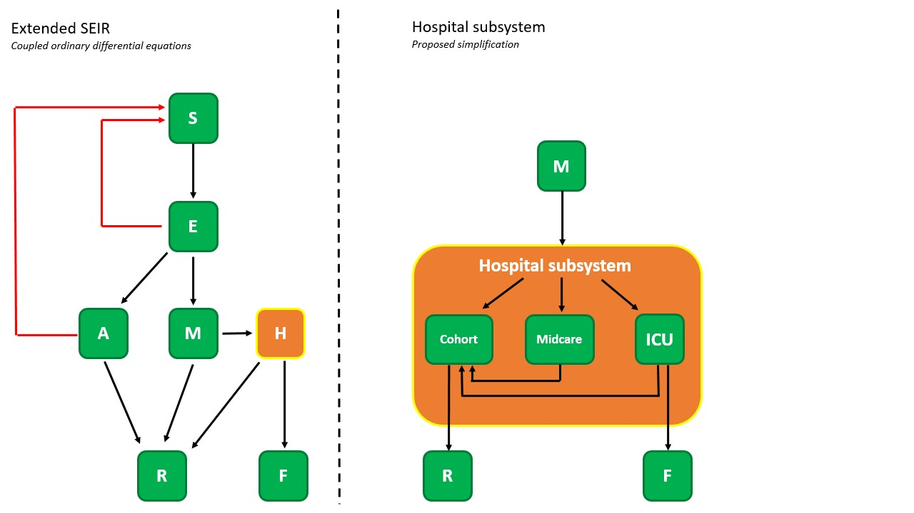

# BIOMATH COVID19-Model
*Original code by Ryan S. McGee. Modified by T.W. Alleman in consultation with the BIOMATH research unit headed by prof. Ingmar Nopens.*

Copyright (c) 2020 by T.W. Alleman, BIOMATH, Ghent University.

## Introduction

Our code implements a SEIRS infectious disease dynamics model with extensions to model the effect of quarantining detected cases. Our code allows to perform Monte Carlo simulations, calibrate model parameters and calculate *optimal* government policies using a model predictive controller (MPC). A white paper and source code of our previous work can be found on the [BIOMATH website](https://biomath.ugent.be/covid-19-outbreak-modelling-and-control).

## Get started

### Get the code

- Create a [`github`](https://github.com/) account if you do not ahve one already.
- On the [COVID19-Model Github repository page](https://github.com/stijnvanhoey/COVID19-Model) click the `Fork` button.
- From your own repository page (your account) of the `COVID19-Model`, use [`git`](https://git-scm.com/) to download the code to your own computer. See the [Github documentation](https://help.github.com/en/github/creating-cloning-and-archiving-repositories/cloning-a-repository) on how to clone/download a repository.

When all went fine, you should have the code on your computer in a directory called `COVID19-Model`.

### Install Python (conda) and packages

To get started using the code, make sure to have all dependencies installed. We recommend using `Anaconda` to manage your Python packages. See the [conda installation instructions](https://docs.anaconda.com/anaconda/install/) and make sure you have conda up and running. Next:

- Setup/update the `environment`: Dependencies are collected in the conda `environment.yml` file, so anybody can recreate the required environment using:

     ```
     conda env create -f environment.yml
     conda activate COVID_MODEL
     ```

     See the [Anaconda navigator documentation](https://docs.anaconda.com/anaconda/navigator/tutorials/manage-environments/#importing-an-environment) how you can import the `environment.yml` file using the GUI.

- Install the code developed specifically for the project (lives inside the `src/covid19model` folder) in the environment (in `-e` edit mode):

     ```
     conda activate COVID_MODEL
     pip install -e .
     ```

     __Note:__ This step needs to be done in a terminal or command prompt. Use your favorite terminal or use the [Anaconda Prompt](https://docs.anaconda.com/anaconda/user-guide/getting-started/#open-anaconda-prompt). Navigate with the `cd` command to the directory where you copied the repository.

### Demo
A demo of the model can be found [here](notebooks/templates/SEIRSAgeModel_demo.ipynb). This notebook can also be run in the browser through binder,

[](https://mybinder.org/v2/gh/UGentBiomath/COVID19-Model/master?filepath=src%2FSEIRSAgeModel_demo.ipynb)

## Start to collaborate!

When working on the model or the model code, make sure to read the following guidelines and keep them in mind. The main purpose of being rigid about the structure of the repository is to improve the general collaboration while keeping structure of the code in the long run and support reproducibility of the work. Still, it is work in progress and it should not block your work. In case you get stuck on something or you have a suggestion for improvement, feel free to open an [New Issue](https://github.com/UGentBiomath/COVID19-Model/issues/new) on the repository.

### Using data

Data is crucial for both the setup and the evaluation of the models and all the required data is collected in the `data` directory. To organize the data sets, the `data` directory has been split up:

- A `raw` folder contains data as it has been downloaded from the original source, __without any changes__ made (neither manual or using code). For each of the data sets it is crucial to describe the source (URL, contact person,...) from which this data set was derived.
- A `interim` folder contains data as it has been adopted to become useful for the model. Use code to transform the data sets in the `raw` folder and store the result in the `interim` folder. The script or function to do the transformation is kept in the `src/covid19model/data/` folder.

__Remember:__ Don't ever edit the `raw` data, especially not manually, and especially not in Excel. Don't overwrite your raw data. Don't save multiple versions of the raw data. Treat the data (and its format) as immutable. The code you write should move the raw data through a pipeline to your final analysis.

To make sure the `data` directory does not become an unstructured set of data files from which no one knows the origin, the following guidelines apply to all data added to the `data` directory:

- All `raw` data files are stored as the downloaded data file.
- All `interim` data file names are written in lowercase, without spaces (use `_` instead).
- When a (new) data set has been downloaded from a source, store it as such in the `raw` directory and document the origin in the [`data/README.md`](./data/README.md) file.
- The functions to prepare data sets are stored in the `src/covid19model/data/` folder. Add the function to the [`data/README.md`](./data/README.md) document to define on which raw files the function operates and which `interim` files are created by it.

### Notebooks are for exploration and communication

Since notebooks are challenging objects for version control (e.g., diffs of the json are often not human-readable and merging is near impossible), we recommended not collaborating directly with others on Jupyter notebooks. There are two steps we recommend for using notebooks effectively:

- Follow a naming convention that shows the owner and the order the analysis was done in. We propose the format <step>-<ghuser>-<description>.ipynb (e.g., 0.3-twallema-model-network.ipynb).
- Reuse the good parts. Don't write code to do the same task in multiple notebooks. If it's a data preprocessing task, put it in the pipeline at `src/covid19model/data/make_dataset.py` and load data from `data/interim`. If it's useful utility code, refactor it and put it in the appropriate subfolder of the `src/covid19model` folder, e;g. visualisations inside `src/covid19model/visualization`

As the code of the `src/covid19model` folder is a Python package itself (see the `setup.py` file). You can import your code and use it in notebooks without the need of reinstallation. Put the following at the top of your notebook:

```
# OPTIONAL: Load the "autoreload" extension so that code can change
%load_ext autoreload

# OPTIONAL: always reload modules so that as you change code in src, it gets loaded
%autoreload 2

from covid19model.models import ...
```

__Note:__ Use one of the [`notebook/templates`](./notebook/templates) to get started. You can run these online using [Binder](https://mybinder.org/v2/gh/UGentBiomath/COVID19-Model/master?filepath=notebook/templates). To use them locally, copy paste one of the templates to the general notebooks directory, rename it according to the defined format and start working on it.

 [](https://mybinder.org/v2/gh/UGentBiomath/COVID19-Model/master?filepath=src%2FSEIRSAgeModel_demo.ipynb)

### Documentation

Documentation consists of both the technical matter about the code as well as background information on the models. To keep these up to date and centralized, we use [Sphinx](https://www.sphinx-doc.org/en/master/) which enables us to keep the documentation together on a website.

The Sphinx setup provides the usage of both `.rst` file, i.e. [restructuredtext](https://docutils.sourceforge.io/docs/ref/rst/restructuredtext.html) as well as `.md` files, i.e. [Markdown](https://www.markdownguide.org/basic-syntax/). The latter is generally experienced as easier to write, while the former provides a more advanced functionalities.

Existing pages can be adusted directly (editing them online or on your computer). When you want to create a new page, makee sure to add the page to the `index.rst` in order to make the page part of the website.

__TODO__ - extend info on this; CI info + how to do it locally...

### The `covid19model` Python package

The code inside the [`src/covid19model`](./src) directory is actually a Python package, which provides a number of additional benefits on the maintenance of the code.

__Note:__ Before doing any changes, always make sure your own version of your code (i.e. `fork`) is up to date with the `master` of the [main repository ](https://github.com/UGentBiomath/COVID19-Model).
     - If you are a command line person, chekc [this work flow](https://gist.github.com/CristinaSolana/1885435)
     - If you are not a command line person: [this work flow](https://www.sitepoint.com/quick-tip-sync-your-fork-with-the-original-without-the-cli/) can help you staying up to date.

For each of the functions you write, make sure to add the documentation to the function. We use the [numpy docstring](https://numpydoc.readthedocs.io/en/latest/format.html) format to write documentation. For each function, make sure the following items are defined at least:

- Short summary (top line)
- Parameters
- Returns
- References (if applicable)


### Repository layout overview

As the previous sections described, each subfolder of the repository has a specific purpose and we would ask to respect the general layout. Still, this is all work in progress, so alterations to it that improve the workflow are certainly possible. Please do your suggestion by creating a [New issue](https://github.com/UGentBiomath/COVID19-Model/issues/new/choose).

__Remember:__ Anyone should be able to reproduce the final products with only the `code` in `src` and the data in `data/raw`!

__TODO__

## Acknowledgements

- The repository setup is a derived version of the [data science cookiecutter](https://drivendata.github.io/cookiecutter-data-science/) providing a consistent structure.
- Original code by Ryan S. McGee

## Model highlights

### Model dynamics
We use an extended version of the SEIR model to model the disease at a higher resolution. This classic SEIR model splits the population into different categories, i.e. susceptible, exposed, infected and removed. We break down the latter two categories in super mild (asymptotic), mild, heavy and critical for the infected part of the population, whereas the removed population indicates the immune and dead fraction. Parameters values are (for now) based on Chinese covid-19 literature but we are seeking to closer collaborate with Belgian hospitals as more data becomes available. The dynamics are modeled using two frameworks: 1) deterministic and 2) stochastic. The deterministic model can fluently run age-structured (metapopulation) simulations naturally by changing the initial conditions.  The stochastic model class is under construction but will be updated soon.



### Additional capabilities
As of now (20/04/2020), the *SEIRSAgeModel* (deterministic model implementation with inherent age-structuring) contains 7 functions which can be grouped into three parts: 1) functions to run and visualise simulations, 2) functions to perform parameter estimations and visualise the results and 3) functions to optimize future policies using model predictive control (MPC).  Also, scenario specific functions will be added over the course of next week.


As of now (20/04/2020), the *SEIRSNetworkModel* contains 5 functions which can be grouped into two parts: 1) functions to run and visualise simulations and 2) functions to perform parameter estimations and visualise the results. Implementing the model predictive controller is straightforward and can easily be done. However, the optimisation problem is really difficult and requires thousands of function evaluations. Given the large amount of computational resources required to run just one stochastic simulation, it is highly unlikely that the model predictive controller will ever be used to optimize government policy. The MPC functions will be implemented and their usefullness assessed after a calibration is performed. Also, scenario specific functions will be added over the course of next week.


## How to use the model
A Jupyter Notebooks containing all scientific details and a tutorial of both frameworks is available in the /src folder.

## Future work

### Model dynamics
Future work will include a modification of the model dynamics most likely according to the flowchart below, this will be done in collaboration with hospitals. We believe these will allow to simulate the disease spread even more realisticly.


### Scenario-specific functions
We will implement a function which uses the past policies to quickly recreate the Belgian ICU and hospitalisation curves up-to-date. This function will be used to quickly propose MPC optimal policies and to perform scenario analysis about the future.
