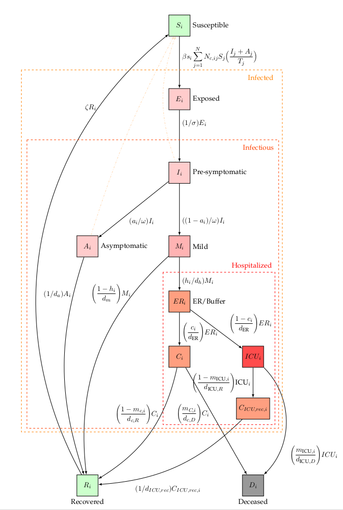

## Introduction

After an initial outbreak in early 2020 in Wuhan, China, Severe acute respiratory syndrome coronavirus 2 (SARS-CoV-2) has spread globally. SARS-CoV-2 is capable of sustained human-to-human trans-
mission, and may cause severe disease, especially in older individuals. The COVID-19 pandemic has, in general, shown a remarkedly low incidence among children and young adults. Children have a lower susceptibility to infection and a lower propensity to show clinical symptoms. Furthermore, pre-symptomatic transmission is a major contributor to SARS-CoV-2 spread.
Unfortunately, pharmaceutical interventions such as vaccination and antiviral drugs are not yet available. On March 13th, 2020, the Belgian governments imposed strict social restrictions after tracing methods had failed to prevent large-scale spread of SARS-CoV-2. One and a half months later, the curve was succesfully flattened and social restrictions were gradually relaxed during the months of May, June and the beginning of July. In spite of these relaxations, hospitalizations kept declining. It is expected that during the coming year(s), preventing COVID-19 outbreaks will depend mostly on the successful implementation of non-pharmaceutical interventions such as social distancing, testing, contact tracing and quarantine. Hence the need for well-informed models that can assist policymakers in choosing the best non-pharmaceutical interventions in case of another large-scale SARS-CoV-2 outbreak. Currently, two other models exist to make predictions for Belgium, the agent-based model of Willem et al. and the discrete-time, stochastic metapopulation model of Coletti et al.

We built a deterministic, continuous-time, age-stratified, extended SEIRD model and calibrated it to national Belgian hospitalization data. The model accounts for pre-symptomatic and asymptomatic transmission. Furthermore, the susceptibility to SARS-CoV-2, the severity of the disease and the susceptibility to a subclinical infection depend on the age of the individual. We used social contact rates from a 2012 study by Willem to model age-specific social mixing. Because detailed hospitalization data are not made publicly available by the Belgian Scientific Institute of Public Health (Sciensano), we derived age-stratified hospitalization parameters from data of 370 patients treated in two Ghent (Belgium) hospitals. To overcome this unconstructive data policy, we used the computed hospitalization parameters as temporary proxies to fit the model to the total number of patients in Belgian hospitals and ICU units. Using the model, we computed the basic reproduction number ($R_0$) during the March 2020 epidemic. Because the model systematically overestimates the hospitalizations during lockdown relaxation, we re-estimated the basic reproduction using data from May 2020 until July 2020.

## The model

### Model dynamics

The SEIR(D) model was first proposed in 1929 by two Scottish scientists. It is a compartmental model that subdivides the human population into four groups: 1) susceptible individuals, 2) exposed individuals in the latent phase 1, 3) infectious individuals capable of transmitting the disease and 4) individuals removed from the population either through immunization or death. Despite being a simple and idealized reality, the SEIR(D) dynamics are used extensively to predict the outbreak of infectious diseases and this was no different during the SARS-CoV-2 outbreak earlier this year.

In this work, we extend the SEIRD model to incorporate more expert knowledge on SARS-CoV-2. For that purpose, the infectious compartment is split into four parts. The first is a period of presymptomatic infectiousness because several studies have shown that pre-symptomatic transmission is a dominant transmission mechanism of SARS-CoV-2. After the period of pre-symptomatic transmission, three possible infectious outcomes are modeled: (1) Asymptomatic outcome, for individuals who show no symptoms at all, (2) Mild outcome, for individuals with mild symptoms who recover at home, and (3) Hospitalization, when mild symptoms worsen. Children and young adults have a high propensity to experience an asymptomatic or mild outcome, while older individual have a high propensity to be hospitalized.

In general, Belgian hospitals have two wards for COVID-19 patients: 1) Cohort, where patients are not monitored permanently and 2) Intensive care, for patients with the most severe symptoms. Intensive care includes permanent monitoring, the use of ventilators or the use of extracorporeal membrane oxygenation (ECMO). Patients generally spend limited time in the emergency room and/or in a buffer ward before going to Cohort. After spending limited time in Cohort, some patients are transferred to ICU. Patients can perish in both wards, but mortalities are generally lower in Cohort. After a stay in an ICU, patients return to Cohort for recovery in the hospital. During the recovery stay, mortality is limited. The above is a short summary of hospital dynamics based on interviewing Ghent University hospital staff and examining the hospital data.

<em> Extended SEIRD dynamics of the BIOMATH COVID-19 model. Nodes represent model states, edges denote transfers. An overview of the model parameters can be found on the bottom of this page.</em>

### Model framework and equations

#### Age-stratification
We introduced heterogeneity in the deterministic implementation by means of age-stratification. Every population compartment is split into a number of age classes, the age-groups have different contact rates with other age-groups and the disease progresses differently for each age-group, making the model behaviour more realistic. Our age-stratified model consists of 9 age classes, i.e., [0-10[, [10-20[, [20-30[, [30-40[, [40-50[, [50-60[, [60-70[, [70-80[, [80- $\infty$[. The age-stratified implementation provides a good balance between added complexity and computational resources.

#### Deterministic framework

Our extended SEIRD model is implemented using two frameworks: a deterministic and a stochastic framework. The deterministic equations are obtained by writing down the following equation,

`rate of change = in - out`,

for every of the 11 population compartments. This results in the following system of coupled ordinary differential equations,

$$
\begin{eqnarray}
\dot{S_i} &=& - \beta s_i \sum_{j=1}^{N} N_{c,ij} S_j \Big( \frac{I_j+A_j}{T_j} \Big) + \zeta R_i, \\
\dot{E_i} &=& \beta s_i \sum_{j=1}^{N} N_{c,ij} S_j \Big( \frac{I_j+A_j}{T_j} \Big) - (1/\sigma) \cdot E_i,  \\ 
\dot{I_i} &=& (1/\sigma) E_i - (1/\omega) I_i, \\
\dot{A_i} &=& (\text{a}_i/\omega) I_i - (1/d_{\text{a}}) A_i, \\ 
\dot{M_i} &=&  ((1-\text{a}_i) / \omega ) I_i - ( (1-h_i)/d_m + h_i/d_{\text{hospital}} ) M_i, \\
\dot{ER_i} &=& (h_i/d_{\text{hospital}}) M_i - (1/d_{\text{ER}}) ER_i, \\
\dot{C_i} &=& c_i (1/d_{\text{ER}}) ER_i  - (m_{C, i}/d_{c,D}) C_i - ((1 - m_{C, i})/d_{c,R}) C_i, \\
\dot{ICU_i} &=& (1-c_i) (1/d_{\text{ER}}) ER_i - (m_{ICU,i}/d_{\text{ICU},D}) ICU_i  \\
&& - ((1-m_{ICU,i})/d_{\text{ICU},R}) ICU_i,\\
\dot{C}_{\text{ICU,rec,i}} &=& ((1-m_{ICU,i})/d_{\text{ICU},R}) ICU_i - (1/d_{\text{ICU,rec}}) C_{\text{ICU,rec,i}}, \\
\dot{D_i} &=&  (m_{ICU,i}/d_{\text{ICU},D}) ICU_i +  (m_{C,i}/d_{\text{c},D}) C_i , \\
\dot{R_i} &=&  (1/d_a) A_i + ((1-h_i)/d_m) M_i + ((1-m_{C,i})/d_{c,R}) C_i \\
&& + (1/d_{\text{ICU,rec}}) C_{\text{ICU,rec,i}} - \zeta R_i,
\end{eqnarray}
$$

for $i = 1,2,...,9$. Here, $T_i$ stands for total population, $S_i$ stands for susceptible, $E_i$ for exposed, $I_i$ for pre-symptomatic and infectious, $A_i$ for asymptomatic and infectious, $M_i$ for mildly symptomatic and infectious, $ER_i$ for emergency room and/or buffer ward, $C_i$ for cohort, $C_{\text{ICU,rec,i}}$ for a recovery stay in Cohort coming from Intensive Care, $ICU_i$ for Intensive Care Unit, $D_i$ for dead and $R_i$ for recovered. Using the above notation, all model states are 9x1 vectors,

$$
\begin{equation}
     \mathbf{S} = [S_1(t)\ S_2(t)\ ...\ S_i(t)]^T,
\end{equation}
$$

where $S_i(t)$ denotes the number of susceptibles in age-class i at time t after the introduction of the virus in the population.

These equations are implemented in the function `COVID19_SEIRD` located in `src/covid19model/models.py`. The integration is performed in `_sim_single` located in `src/covid19model/base.py` by using Scipy's `solve_ivp`. The integrator timestep depends on the rate of change of the system and the solver method is thus referred to as a 'continuous-time' solver. The implementation uses non-integer individuals.

#### Stochastic framework

By defining the probabilities of transitioning (propensities) from one state to another, a system of coupled stochastic difference equations (SDEs) can be obtained. The probability to transition from one state to another is assumed to be exponentially distributed. As an example, consider the average time a patient spends in an ICU when recovering, which is $d_{\text{ICU,R}} = 9.9$ days. The chances of survival in ICU are $(1-m_{\text{ICU,i}})$, where $m_{\text{ICU,i}}$ is the mortality in ICU for an individual in age group $i$. The probability of transitioning from state ICU to state $C_{\text{ICU,rec}}$ on any given day and for an individual in age group $i$ is,

$$
\begin{equation}
P(ICU_i \rightarrow C_{\text{ICU,rec,i}}) = 1 - \text{exp} \Bigg[ - \frac{1-m_{\text{ICU},i}}{d_{\text{ICU,R}}}\Bigg].
\end{equation}
$$

If a transitioning between states is defined as "succes", we can regard the number of individuals transitioning from ICU to a Cohort recovery ward as a binomial experiment. On a given day, the number of individuals transitioning is,

$$
\begin{equation}
(\text{ICU}_i \rightarrow C_{\text{ICU,rec,i}})(k) \sim \text{Binomial}\Bigg(\text{ICU}_i(k),\ 1 - \text{exp}\Bigg[- \frac{1-m_{\text{ICU,i}}}{d_{\text{ICU,R}}}\Bigg]\Bigg). 
\end{equation}
$$

For a discrete stepsize $l$, there are 15 possible transitions,

$$
\begin{eqnarray}
(S_i \rightarrow E_i) (k) &\sim& \text{Binomial}\Bigg(S_i(k), 1 - \text{exp}\Bigg[- l \beta s_i \sum_{j=1}^{N} N_{c,ij} S_j \Big( \frac{I_j+A_j}{T_j} \Big) \Bigg]\Bigg)\\
(E_i \rightarrow I_i) (k) &\sim& \text{Binomial}\Bigg(E_i(k), 1 - \text{exp}\Bigg[- l\ \frac{1}{\sigma}\Bigg]\Bigg)\\
(I_i \rightarrow A_i) (k) &\sim& \text{Binomial}\Bigg(I_i(k), 1 - \text{exp}\Bigg[- l\ \frac{a_i}{\omega}\Bigg]\Bigg)\\
(I_i \rightarrow M_i) (k) &\sim& \text{Binomial}\Bigg(I_i(k), 1 - \text{exp}\Bigg[- l\ \frac{1-a_i}{\omega}\Bigg]\Bigg)\\
(A_i \rightarrow R_i) (k) &\sim& \text{Binomial}\Bigg(A_i(k), 1 - \text{exp}\Bigg[- l\ \frac{1}{d_a}\Bigg]\Bigg)\\
(M_i \rightarrow R_i) (k) &\sim& \text{Binomial}\Bigg(M_i(k), 1 - \text{exp}\Bigg[- l\ \frac{1-h_i}{d_m}\Bigg]\Bigg)\\
(M_i \rightarrow ER_i) (k) &\sim& \text{Binomial}\Bigg(M_i(k), 1 - \text{exp}\Bigg[- l\ \frac{h_i}{d_{\text{hospital}}}\Bigg]\Bigg)\\
(ER_i \rightarrow C_i) (k) &\sim& \text{Binomial}\Bigg(ER_i(k), 1 - \text{exp}\Bigg[- l\ \frac{c_i}{d_{\text{ER}}}\Bigg]\Bigg)\\
(ER_i \rightarrow ICU_i) (k) &\sim& \text{Binomial}\Bigg(ER_i(k), 1 - \text{exp}\Bigg[- l\ \frac{1-c_i}{d_{\text{ER}}}\Bigg]\Bigg)\\
(C_i \rightarrow R_i) (k) &\sim& \text{Binomial}\Bigg(C_i(k), 1 - \text{exp}\Bigg[- l\ \frac{1-m_{C,i}}{d_{C,R}}\Bigg]\Bigg)\\
(ICU_i \rightarrow C_{\text{ICU,rec,i}}) (k) &\sim& \text{Binomial}\Bigg(ICU_i(k), 1 - \text{exp}\Bigg[- l\ \frac{1-m_{\text{ICU,i}}}{d_{ICU,R}}\Bigg]\Bigg)\\
(C_{\text{ICU,rec,i}} \rightarrow R_i) (k) &\sim& \text{Binomial}\Bigg(C_{\text{ICU,rec,i}}(k), 1 - \text{exp}\Bigg[- l\ \frac{1}{d_{\text{ICU,rec}}}\Bigg]\Bigg)\\
(C_i \rightarrow D_i) (k) &\sim& \text{Binomial}\Bigg(C_i(k), 1 - \text{exp}\Bigg[- l\ \frac{m_{C,i}}{d_{C,D}}\Bigg]\Bigg)\\
(ICU_i \rightarrow D_i) (k) &\sim& \text{Binomial}\Bigg(ICU_i(k), 1 - \text{exp}\Bigg[- l\ \frac{m_{\text{ICU,i}}}{d_{\text{ICU,D}}}\Bigg]\Bigg)\\
(R_i \rightarrow S_i) (k) &\sim& \text{Binomial}\Bigg(R_i(k), 1 - \text{exp}\Bigg[- l\ \zeta \Bigg]\Bigg)\\
\end{eqnarray}
$$

And the system of equations becomes,

$$
\begin{eqnarray}
S_i(k+1) &=& S_i(k) + (R_i \rightarrow S_i) (k) - (S_i \rightarrow E_i) (k) \\
E_i(k+1) &=& E_i(k) + (S_i \rightarrow E_i) (k) - (E_i \rightarrow I_i) (k) \\
I_i(k+1) &=& I_i(k) + (E_i \rightarrow I_i) (k) - (I_i \rightarrow A_i) - (I_i \rightarrow M_i) (k) \\
A_i(k+1) &=& A_i(k) + (I_i \rightarrow A_i) (k) - (A_i \rightarrow R_i) (k) \\
M_i(k+1) &=& M_i(k) + (I_i \rightarrow M_i) (k) - (M_i \rightarrow R_i) (k) - (M_i \rightarrow ER_i) (k) \\
ER_i(k+1) &=& ER_i(k) + (M_i \rightarrow ER_i) (k) - (ER_i \rightarrow C_i) (k) - (ER_i \rightarrow ICU_i) (k) \\
C_i(k+1) &=& C_i(k) + (ER_i \rightarrow C_i) (k) - (C_i \rightarrow R_i) (k) - (C_i \rightarrow D_i) (k) \\
C_{\text{ICU,rec,i}}(k+1) &=& C_{\text{ICU,rec,i}}(k)  + (ICU_i \rightarrow C_{\text{ICU,rec,i}}) (k) - (C_{\text{ICU,rec,i}} \rightarrow R_i) (k) \\
R_i(k+1) &=& R_i(k) + (A_i \rightarrow R_i) (k)  + (M_i \rightarrow R_i) (k) + (C_i \rightarrow R_i) (k)\\
&& + (C_{\text{ICU,rec,i}} \rightarrow R_i) (k)  - (R_i \rightarrow S_i) (k) \\
D_i(k+1) &=& D_i(k) + (ICU_i \rightarrow D_i) (k) + (C_i \rightarrow D_i) (k) \\
\end{eqnarray}
$$

These equations are implemented in the function `COVID19_SEIRD_sto` located in `src/covid19model/models.py`. The computation itself is performed in the function `solve_discrete` located in `src/covid19model/base.py`. Please note that the deterministic model uses **differentials** in the model defenition and must be integrated, while the stochastic model uses **differences** and must be iterated. The discrete timestep is fixed at one day. The stochastic implementation only uses integer individuals, which is considered an advantage over the deterministic implementation.

### Stochastic spatial framework

*Disclaimer: preliminary and subject to changes*

<em> Percentage of arrondissement population experiencing mild COVID-19 symptoms. Simulation started with cluster located in arrondissement Aarlen, in Belgiums far southeast. A total of 250 days are simulated. Non-calibrated spatial model, meant for explanatory purposes. </em>

We built upon the stochastic national-level model to take spatial heterogeneity into account. The Belgian territory is divided into 43 arrondissements, which are from hereon referred to as *patches*. Our patch-model boils down to a simulation of the extended SEIRD model dynamics on each patch, where the patches are connected by commuting traffic. This takes the form of a 43x43 from-to commuting matrix, `place`, extracted from the 2011 Belgian census. The system of equations is identical to the national level model, for a resident of age group i in patch g,

$$
\begin{eqnarray}
S_{i,g}(k+1) &=& S_{i,g}(k) + (R_{i,g} \rightarrow S_{i,g}) (k) - (S_{i,g} \rightarrow E_{i,g}) (k) \\
E_{i,g}(k+1) &=& E_{i,g}(k) + (S_{i,g} \rightarrow E_{i,g}) (k) - (E_{i,g} \rightarrow I_{i,g}) (k) \\
I_{i,g}(k+1) &=& I_{i,g}(k) + (E_{i,g} \rightarrow I_{i,g}) (k) - (I_{i,g} \rightarrow A_{i,g}) - (I_{i,g} \rightarrow M_{i,g}) (k) \\
A_{i,g}(k+1) &=& A_{i,g}(k) + (I_{i,g} \rightarrow A_{i,g}) (k) - (A_{i,g} \rightarrow R_{i,g}) (k) \\
M_{i,g}(k+1) &=& M_{i,g}(k) + (I_{i,g} \rightarrow M_{i,g}) (k) - (M_{i,g} \rightarrow R_{i,g}) (k) - (M_{i,g} \rightarrow ER_{i,g}) (k) \\
ER_{i,g}(k+1) &=& ER_{i,g}(k) + (M_{i,g} \rightarrow ER_{i,g}) (k) - (ER_{i,g} \rightarrow C_{i,g}) (k) - (ER_{i,g} \rightarrow ICU_{i,g}) (k) \\
C_{i,g}(k+1) &=& C_{i,g}(k) + (ER_{i,g} \rightarrow C_{i,g}) (k) - (C_{i,g} \rightarrow R_{i,g}) (k) - (C_{i,g} \rightarrow D_{i,g}) (k) \\
C_{\text{ICU,rec,i,g}}(k+1) &=& C_{\text{ICU,rec,i,g}}(k)  + (ICU_{i,g} \rightarrow C_{\text{ICU,rec,i,g}}) (k) - (C_{\text{ICU,rec,i,g}} \rightarrow R_{i,g}) (k) \\
R_{i,g}(k+1) &=& R_{i,g}(k) + (A_{i,g} \rightarrow R_{i,g}) (k)  + (M_{i,g} \rightarrow R_{i,g}) (k) + (C_{i,g} \rightarrow R_{i,g}) (k)\\
&& + (C_{\text{ICU,rec,i,g}} \rightarrow R_{i,g}) (k)  - (R_{i,g} \rightarrow S_{i,g}) (k) \\
D_{i,g}(k+1) &=& D_{i,g}(k) + (ICU_{i,g} \rightarrow D_{i,g}) (k) + (C_{i,g} \rightarrow D_{i,g}) (k) \\
\end{eqnarray}
$$

Differing only in the chance of infection $(S_{i,g} \rightarrow E_{i,g}) (k)$. All other possible transitions are dependent on the disease dynamics and not on the spatial coordinate of the individual. If the individual works within his own patch, the individual is assumed to have contacts with people from within his home patch only. The interaction matrix for individuals working in their residence patch is the sum of home, school, work, leisure and other human-to-human interactions per day. If the individual does not work in his home patch, the work vs home, school, leisure, other human-to-human contacts must be seperated,

$$
\begin{eqnarray}
    P(S_{i,g} \rightarrow E_{i,g}) (k) &=& 1 - \text{exp} \Bigg[ \underbrace{\text{place}_{g,g} \Bigg\{ - l \beta s_i \sum_{j=1}^{N} N_{\text{c, tot, ij}} S_{j,g} \Bigg( \frac{I_{j,g} + A_{j,g}}{T_{j,g}} \Bigg) \Bigg\}}_{\text{individual working in residence patch}}  \\
    &+& \sum_{l=1\\ l \neq g}^{G} \text{place}_{g,l} \Bigg\{ \underbrace{- l \beta s_i \sum_{j=1}^{N} N_{\text{c, work, ij}} S_{j,l} \Bigg( \frac{I_{j,l} + A_{j,l}}{T_{j,l}} \Bigg)}_{\text{work interactions in work patch (subscript l)}} \\
     &-& \underbrace{l \beta s_i \sum_{j=1}^{N} (N_{\text{c, home, ij}} + N_{\text{c, school, ij}} + N_{\text{c, leisure, ij}} + N_{\text{c, others, ij}}) S_{j,g} \Bigg( \frac{I_{j,g} + A_{j,g}}{T_{j,g}} \Bigg)}_{\text{all other interactions in home patch (subscript g)}} \Bigg\} \Bigg]
\end{eqnarray}
$$

- $i \in \big\{0, 1, ..., N\big\}$ where N is the number of age groups (9).
- $g \in \big\{0, 1, ..., G\big\}$ where G is the number of arrondissements (43).

These equations are implemented in the function `COVID19_SEIRD_sto_spatial` located in `src/covid19model/models.py`. The computation itself is performed in the function `solve_discrete` located in `src/covid19model/base.py`. Please note that the deterministic model uses **differentials** in the model defenition and must be integrated, while the stochastic model uses **differences** and must be iterated. The discrete timestep is fixed at one day. The stochastic implementation only uses integer individuals, which is considered an advantage over the deterministic implementation.

### Transmission rates and social contact data

In our model, the transmission rate of the disease depends on the product of four contributions. The first contribution, $(I+A)/T$, is the fraction of contagious individuals in the population. The second contribution, $\mathbf{N}_c$, is the average number of human-to-human interactions per day. The third contribution, $s_i$, is the relative susceptiblity to SARS-CoV-2 infection in age group $i$, and the fourth contribution, $\beta$, is the probability of contracting COVID-19 when encountering a contagious individual under the assumption of 100 \% susceptibility to SARS-CoV-2 infection. We assume that the per contact transmission probability $\beta$ is independent of age and we will infer its distribution by calibrating the model to national Belgian hospitalization data. The number of human-human interactions, $\mathbf{N}_c$, are both place and age-dependent. These matrices assume the form of a 9x9 *interaction matrix* where an entry X, Y denotes the number of social contacts age group X has with age group Y per day. These matrices are available for homes, schools, workplaces, in public transport, and leisure activities, from a survey study by Lander Willem (2012). The total number of social interactions is given by the sum of the contributions in different places,

$$
\begin{equation}\label{eq:interaction_matrices}
\mathbf{N_{\text{c}}} = \mathbf{N_{\text{c, home}}} + \mathbf{N_{\text{c, schools}}} + \mathbf{N_{\text{c, work}}} + \mathbf{N_{\text{c, transport}}} + \mathbf{N_{\text{c, leisure}}} + \mathbf{N_{\text{c, others}}}.
\end{equation}
$$

Coefficients can be added to the contributing contact matrices to model a goverment policy. For instance, to model the Belgian lockdown, the mobility reductions deduced from the Google community mobility reports were used as coefficients for the different interaction matrices. We assumed workplace interactions were down to only 40 % of their prepandemic values before the lockdown.

### Modeling social intertia

The model takes into account the effect of *social inertia* when measures are taken. In reality, social restrictions or relaxations represent a change in behaviour which is gradual and cannot be modeled using a step-wise change of the social interaction matrix $\mathbf{N_c}$. This can be seen when closely inspecting the *Google community mobility report* above. Multiple functions can be used to model the effects of social compliance, e.g. a delayed or non-delayed ramp, or a logistic function. In our model, we use a delayed ramp to model compliance, 

$$
\begin{equation}
\mathbf{N_{c}}^{k} = \mathbf{N_{\text{c, old}}} + f^{k} (\mathbf{N_{\text{c, new}}} - \mathbf{N_{\text{c, old}}})
\end{equation}
$$

where,

$$
\begin{equation}
    f^k= 
\begin{cases}
	0.0,& \text{if } k\leq \tau\\
    \frac{k}{l} - \frac{\tau}{l},& \text{if } \tau < k\leq \tau + l\\
    1.0,              & \text{otherwise}
\end{cases}
\end{equation}
$$

where $\tau$ is the number of days before measures start having an effect and $l$ is the number of additional days after the time delay until full compliance is reached. Both parameters were calibrated to the daily number of hospitalizations in Belgium (notebooks `notebooks/0.1-twallema-calibration-deterministic.ipynb` and `notebooks/0.1-twallema-calibration-stochastic.ipynb`). $k$ denotes the number of days since a change in social policy.

### Basic reproduction number

The basic reproduction number $R_0$, defined as the expected number of secondary cases directly generated by one case in a population where all individuals are susceptible to infection, is computed using the next generation matrix (NGM) approach introducted by Diekmann. For our model, the basic reproduction number of age group $i$ is,

$$
\begin{equation}\label{eq:reproduction_number}
R_{0,i} = (a_i d_a + \omega) \beta s_i \sum_{j=1}^{N} N_{c,ij}
\end{equation}
$$

and the population basic reproduction number is calculated as the weighted average over all age groups using the demographics of Belgium. The detailed algebra underlying the computation equation of the basic reproduction number is presented in the supplementary materials of our manuscript (see section *Previous work*).

### Model parameters

An in-depth motivation of the model parameters is provided in our manuscript (see section *Previous work*). Hospital parameters were derived from a dataset obtained from two hospitals in Ghent (Belgium).

<em> Overview of BIOMATH COVID-19 model parameters. </em>

