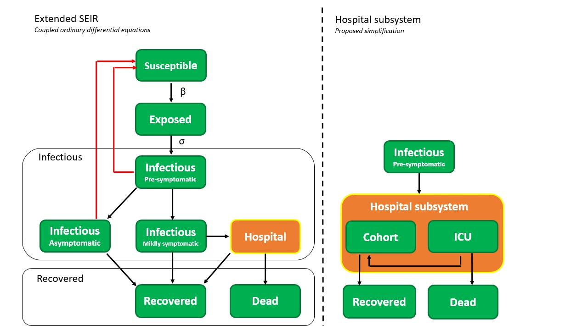
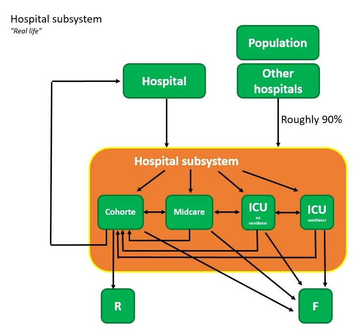
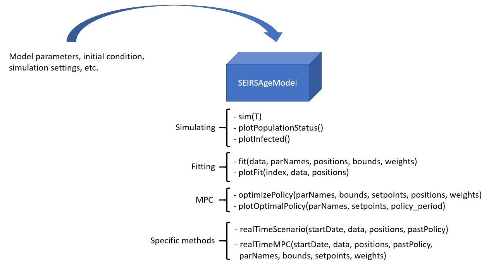

# Model

## Introduction

We use an extended version of the SEIR model to model the disease at a higher resolution. This classic SEIR model splits the population into different categories, i.e. susceptible, exposed, infected and removed. We break down the latter two categories in super mild (asymptotic), mild, heavy and critical for the infected part of the population, whereas the removed population indicates the immune and dead fraction. Parameters values are (for now) based on Chinese covid-19 literature but we are seeking to closer collaborate with Belgian hospitals as more data becomes available. The dynamics are modeled using two frameworks: 1) deterministic and 2) stochastic. The deterministic model can fluently run age-structured (metapopulation) simulations naturally by changing the initial conditions.  The stochastic model class is under construction but will be updated soon.

## General

The SEIR model was first proposed in 1929 by two Scottish scientists. It is a compartmental model that subdivides the human population in four types of people :

1. healthy individuals susceptible to the infectious disease,
2. exposed individuals in a latent phase (partially the incubation period),
3. infectious individuals able to transmit the disease
4. individuals removed from the population either through immunisation or death.

Despite being a simple and idealised reality, the SEIR model is used extensively to predict the outbreak of infectious diseases and this was no different during the outbreak in China earlier this year. In this work, we extended the SEIR model to incorporate more expert knowledge on SARS-Cov-2 into the model. The infectious pool is split into four parts. The first is a period of pre-symptomatic infectiousness. Several studies have shown that pre-symptomatic transmission is a dominant transmission mechanism of SARS-Cov-2. After the period of pre-symptomatic transmission, three possible infectious outcomes are modelled.

1. asymptomatic outcome, for patients who show no symptoms at all
2. mild outcome, for patients with mild symptoms, these patients recover at home
3. a mild infection can degress to the point where a hospitalision is needed.

 The pool of *recovered* individuals from the classical SEIR model is split into an recovered and dead pool. People from the susceptible, exposed, pre-symptomatic infectious, asymptomatic infectious, mild infectious and recovered pool can be quarantined after having tested positive for Covid-19. Note that for individuals in the susceptible and recovered pools, this corresponds to a *false positive* test. The dynamics of our extended SEIR model are presented in the flowchart below.

We make the following assumptions with regard to the SEIRS dynamics:

1. There is no connection between the severity of the disease and the infectiousness of an individual. Only the duration of infectiousness can differ.
2. All patients experience a brief pre-symptomatic, infectious period.
3. All deaths come from intensive care units in hospitals, meaning no patients die outside a hospital. Of the 7703 diseased (01/05/2020), 46\% died in a hospital while 53\% died in an elderly home. All hospital deaths are confirmed Covid-19 cases while only 16\% of elderly home deaths were confirmed. When taking the elderly homes out of the model scope, the assumption that deaths only arise in hospitals is true due to the fact that only 0.3\% died at home and 0.4\% died someplace else. Asymptomatic and mild cases automatically lead to recovery and in no case to death (https://www.info-coronavirus.be/nl/news/trends-laatste-dagen-zetten-zich-door/).
4. We implement no testing and quarantining in the hospital. Hospitalised persons are assumed to be incapable of infecting susceptibles, so the implementation of a quarantine would not change the dynamics but slow down calculations.
5. Recovered patients are assumed to be immune
6. Seasonality is deemed out of scope of this work.

## Hospital subystem (preliminary)

The hospital subsystem is a simplification of actual hospital dynamics. The dynamics and estimated parameters were obtained by interviewing Ghent University Hospital staff and presenting the resulting meeting notes to the remaining three Ghent hospitals for verification.

At the time of writing (30/04/2020) every admitted patient is tested for Covid-19. Roughly 10% of all Covid-19 patients at UZ Ghent originally came to the hospital for some other medical condition. The remaining 90% of all Covid-19 arrives in the emergency room or comes from hospitals in heavily struck regions. The fraction of people the hospital when getting infected with Covid-19 are reported to authorities as ‘new hospitalisations’. There are three hospital wards for Covid-19 patients: 1) Cohort, which should be seen like a regular hospital ward with Covid-19 patients. Patients are not monitored permanently in this ward. 2) Midcare, a ward where more severe cases are monitored more cosely than in Cohort. Midcare is more closely related to ICU than to Cohort and is usually lumped with the number of ICU patients when reporting to the officials. 3) Intensive care, for patients with the most severe symptoms. Intensive care needs can include the use of a ventilator to supply the patient with oxygen. It was noted that the fraction Cohort vs. Midcare and ICU is roughly 50-50%.

Generally, patients can switch between any of the wards depending on how the disease progresses. However, some dominant *flows* exist. Usually, it is apparent upon a patients arrival to which ward he or she will be assigned. On average patients who don’t degress stay in Cohort for 6 days, with values spread between 3 and 8 days. The average ICU stay is 14 days when a patient doesn’t need ventilation. If the patient needs ventilation the stay is slightly longer. After being in ICU, patients return to Cohort for an another 6 to 7 days of recovery. Based on these dominant *flows*, the hospital subsystem was simplified by making the following assumptions:

1. Assume people arriving at the hospital are instantly distributed between Cohort, Midcare or ICU.
2. Merge ventilator and non-ventilator ICU.
3. Assume deaths can only arise in ICU.
4. Assume all patients in midcare and ICU pass via Cohort on their way to recovery.
5. Assume that the 10\% of the patients that come from hospital actually come from the population.

## Model description

The dynamics of the deterministic system are mathematically formulated as the rate of change of each population pool shown in the above flowchart. This results in the following system of ordinary differential equations (the parameters are explained in the next section):

### Equations

$$
\begin{eqnarray}
\dot{S} &=& - \beta N_c \cdot S \cdot \Big( \frac{I+A}{N} \Big) - \theta_{\text{S}} \psi_{\text{FP}} \cdot S + SQ/d_{\text{q,FP}} + \zeta \cdot R,\\
\dot{E} &=&  \beta \cdot N_c \cdot S \Big( \frac{I+A}{N} \Big) - (1/\sigma) \cdot E - \theta_{\text{E}} \psi_{\text{PP}} \cdot E,\\
\dot{I} &=& (1/\sigma) \cdot E - (1/\omega) \cdot I - \theta_I \psi_{PP} \cdot I,\\
\dot{A} &=& (\text{a}/\omega) \cdot I - A/d_{\text{a}} - \theta_{\text{A}} \psi_{\text{PP}} \cdot A,\\
\dot{M} &=&  (\text{m} / \omega ) \cdot I - M \cdot ((1-h)/d_m) - M \cdot h/d_{\text{hospital}} - \theta_{\text{M}} \psi_{\text{PP}} \cdot M,\\
\dot{C} &=& c \cdot (M+MQ) \cdot (h/d_{\text{hospital}}) - c \cdot(1/d_c)\cdot C,\\
\dot{C}_{\text{mi,rec}} &=& Mi/d_{\text{mi}} - C_{\text{mi,rec}} \cdot (1/d_{\text{mi,rec}}),\\
\dot{C}_{\text{ICU,rec}} &=& (1-m_0)/d_{\text{ICU}} \cdot \text{ICU} - C_{\text{ICU,rec}} \cdot (1/d_{\text{ICU,rec}}),\\
C_{\text{tot}} &=& C + C_{\text{mi,rec}} + C_{\text{ICU,rec}}, \\
\dot{\text{Mi}} &=&  mi \cdot (M+MQ) \cdot (h/d_{\text{hospital}}) - \text{Mi} / d_{\text{mi}}\\
\dot{\text{ICU}} &=& (1-c-mi) \cdot (M+MQ) \cdot (h/d_{\text{hospital}}) - \text{ICU}/d_{\text{ICU}},\\
H &=& C_{\text{tot}} + \text{Mi} + \text{ICU},\\
\dot{D} &=& m_0 \cdot \text{ICU}/d_{\text{ICU}},\\
\dot{R} &=&  A/d_a + M \cdot ((1-h)/d_m) + (1/d_c) \cdot c \cdot M \cdot (h/d_{\text{hospital}}) \\ && + (M_i/d_{mi}) \cdot (1/d_{\tiny{\text{mi,recovery}}})+ ((1-m_0)/ d_{\text{ICU}}) \cdot (1/d_{\text{\tiny{ICU,recovery}}}) \cdot ICU  \\
&& + AQ/d_a + MQ \cdot ((1-h)/d_m)+ RQ/d_{\text{q,FP}} - \zeta \cdot R, \\
\dot{SQ} &=& \theta_{\text{S}} \psi_{\text{FP}} \cdot S - (1/d_{\text{q,FP}}) \cdot SQ, \\
\dot{EQ} &=& \theta_{\text{E}} \psi_{\text{PP}} \cdot E - (1/\sigma) \cdot EQ, \\
\dot{IQ} &=& \theta_{\text{I}} \psi_{\text{PP}} \cdot I + (1/\sigma) \cdot EQ - (1/\omega) \cdot IQ, \\
\dot{AQ} &=& \theta_{\text{A}} \psi_{\text{PP}} \cdot A + (a/\omega) \cdot EQ - AQ/d_a, \\
\dot{MQ} &=& \theta_{\text{M}} \psi_{\text{PP}} \cdot M + (m/\omega) \cdot EQ - MQ \cdot ((1-h)/d_m) - MQ \cdot h/d_{\text{hospital}}, \\
\dot{RQ} &=& \theta_{\text{R}} \psi_{\text{FP}} - (1/d_{\text{q,FP}}) \cdot RQ,
\end{eqnarray}
$$

In the above equations: `S` stands for susceptible, `E` for exposed (infected, but not yet infectious), `I` for infectious, `A` for asymptomatic, `M` for mild, `H` for hospitalised, `C` for cohort, `Mi` for midcare, `ICU` for intensive care unit, `D` for dead, `R` for recovered. The quarantined states are denoted with a `Q` suffix, for example `AQ` stands for asymptomatic and quarantined. The states `S`, `E`, `A`, `M` and `R` can be quarantined. The disease dynamics when quarantined are identical to the non quarantined dynamics. For instance, `EQ` will evolve into `AQ` or `MQ` with the same probability as `E` evolves into `A` or `M`. Individuals from the `MQ` pool can end up in the hospital. `N` stands for the total population.

### Parameters

The clinical parameters are:

- `a`, `m`: the chance of having an asymptomatic or mild infection.
- `h`: the fraction of mildly infected which require hospitalisation.
- `c`: fraction of the hospitalised which remain in Cohort
- `mi`: fraction of hospitalised which end up in midcare.

Based on reported cases in China and travel data, Li et al. (2020b) estimated that 86\% of coronavirus infections in the country were "undocumented" in the weeks before officials instituted stringent quarantines. This figure thus includes the asymptomatic cases and an unknown number of mildly symptomatic cases and is thus an overestimation of the asymptotic fraction. In Iceland, citizens were invited for testing regardless of symptoms. Of all people with positive test results, 43% were asymptomatic (Gudbjartsson et al., 2020). The actual number of asymptomatic infections might be even higher since it seemed that symptomatic persons were more likely to respond to the invitation (Sciensano, 2020). In this work it is assumed that 43\% of all infected cases are asymptomatic. This figure can later be corrected in light of large scale immunity testing in the Belgian population. Hence, `a = 0.43`.

Wu and McGoogan (2020) estimated that the distribution between mild, severe and critical cases is equal to 81%, 15% and 4% respectively. As a rule of thumb, one can assume that one third of all hospitalised patients ends up in an ICU. Based on interviews with Ghent University hospital staff, midcare is merged with ICU in the offical numbers. For now, it is assumed that the distribution between midcare and ICU is 50-50 %. The sum of both pools is one third of the hospitalisations. Since the average time a patient spends in midcare is equal to ICU, this corresponds to seeing midcare and ICU as 'ICU'.

- $\sigma$: length of the latent period. Assumed four days based on a modeling study by Davies et al. (2020)
- $\omega$: length of the pre-symptomatic infectious period, assumed 1.5 days (Davies et al. 2020). The sum of $\omega$ and $\sigma$ is the total incubation period, and is equal to 5.5 days. Several estimates of the incubation period have been published and range from 3.6 to 6.4 days, with the majority of estimates around 5 days (Park et. al 2020).
- $d_{a}$ , $d_{m}$ , $d_{h}$ : the duration of infection in case of a asymptomatic or mild infection. Assumed to be 6.5 days. Toghether with the length of the pre-symptomatic infectious period, this accounts to a total of 8 days of infectiousness.
- $d_{c}$ , $d_{\text{mi}}$ , $d_{\text{ICU}}$: average length of a Cohort, Midcare and ICU stay. Equal to one week, two weeks and two weeks respectively.
- $d_{\text{mi,recovery}}$ , $d_{\text{ICU,recovery}}$: lengths of recovery stays in Cohort after being in Midcare or IC. Equal to one week.

Zhou et al. (2020) performed a retrospective study on 191 Chinese hospital patients and determined that the time from illness onset to discharge or death was 22.0 days (18.0-25.0, IQR) and 18.5 days (15.0-22.0, IQR) for survivors and victims respectively. Using available preliminary data, the World Health Organisation estimated the median time from onset to clinical recovery for mild cases to be approximately 2 weeks and to be 3-6 weeks for patients with severe or critical disease (WHO, 2020). Based on this report, we assume a recovery time of three weeks for heavy infections.

- $d_{hospital}$ : the time before heavily or critically infected patients reach the hospital. Assumed 5-9 days (Linton et al. 2020). Still waiting on hospital input here.
- $m_0$ : the mortality in ICU, which is roughly 50\% (Wu and McGoogan, 2020).
- $\zeta$: can be used to model the effect of re-susceptibility and seasonality of a disease. Throughout this demo, we assume $\zeta = 0$ because data on seasonality is not yet available at the moment. We thus assume permanent immunity after recovering from the infection.

## Implementation

As of now (20/04/2020), the *SEIRSAgeModel* (deterministic model implementation with inherent age-structuring) contains 7 functions which can be grouped into three parts: 1) functions to run and visualise simulations, 2) functions to perform parameter estimations and visualise the results and 3) functions to optimize future policies using model predictive control (MPC).  Also, scenario specific functions will be added over the course of next week.

As of now (20/04/2020), the *SEIRSNetworkModel* contains 5 functions which can be grouped into two parts: 1) functions to run and visualise simulations and 2) functions to perform parameter estimations and visualise the results. Implementing the model predictive controller is straightforward and can easily be done. However, the optimisation problem is really difficult and requires thousands of function evaluations. Given the large amount of computational resources required to run just one stochastic simulation, it is highly unlikely that the model predictive controller will ever be used to optimize government policy. The MPC functions will be implemented and their usefullness assessed after a calibration is performed. Also, scenario specific functions will be added over the course of next week.

$\sigma$: length of the latent period. Assumed four days based on a modeling study by Davies et al. (2020) .

$\omega$: length of the pre-symptomatic infectious period, assumed 1.5 days (Davies et al. 2020). The sum of $\omega$ and $\sigma$ is the total incubation period, and is equal to 5.5 days. Several estimates of the incubation period have been published and range from 3.6 to 6.4 days, with the majority of estimates around 5 days (Park et. al 2020).

$d_{a}$ , $d_{m}$ , $d_{h}$ : the duration of infection in case of a asymptomatic or mild infection. Assumed to be 6.5 days. Toghether with the length of the pre-symptomatic infectious period, this accounts to a total of 8 days of infectiousness.

$d_{c}$ , $d_{\text{mi}}$ , $d_{\text{ICU}}$: average length of a Cohort, Midcare and ICU stay. Equal to one week, two weeks and two weeks respectively.

$d_{\text{mi,recovery}}$ , $d_{\text{ICU,recovery}}$: lengths of recovery stays in Cohort after being in Midcare or IC. Equal to one week.

Zhou et al. (2020) performed a retrospective study on 191 Chinese hospital patients and determined that the time from illness onset to discharge or death was 22.0 days (18.0-25.0, IQR) and 18.5 days (15.0-22.0, IQR) for survivors and victims respectively. Using available preliminary data, the World Health Organisation estimated the median time from onset to clinical recovery for mild cases to be approximately 2 weeks and to be 3-6 weeks for patients with severe or critical disease (WHO, 2020). Based on this report, we assume a recovery time of three weeks for heavy infections.

$d_{hospital}$ : the time before heavily or critically infected patients reach the hospital. Assumed 5-9 days (Linton et al. 2020). Still waiting on hospital input here.

$m_0$ : the mortality in ICU, which is roughly 50\% (Wu and McGoogan, 2020).

$\zeta$: can be used to model the effect of re-susceptibility and seasonality of a disease. Throughout this demo, we assume $\zeta = 0$ because data on seasonality is not yet available at the moment. We thus assume permanent immunity after recovering from the infection.

