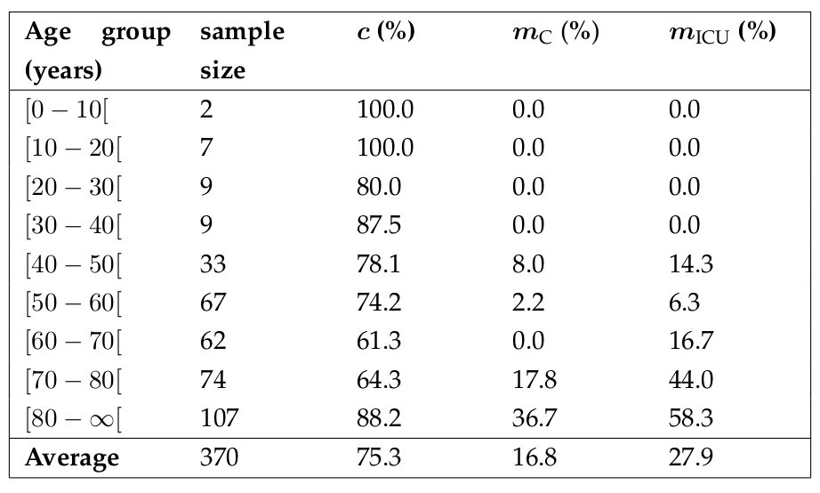
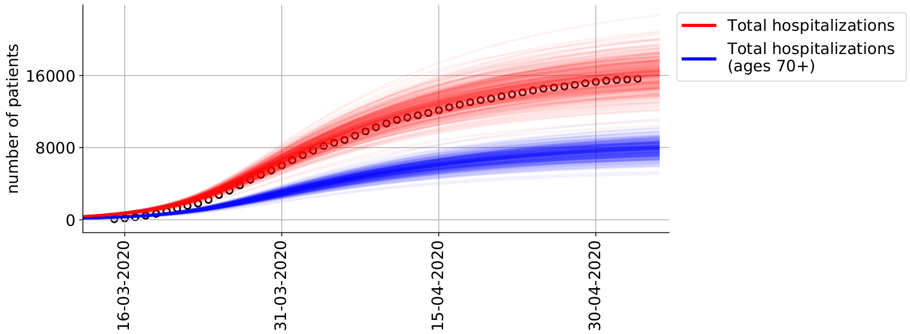
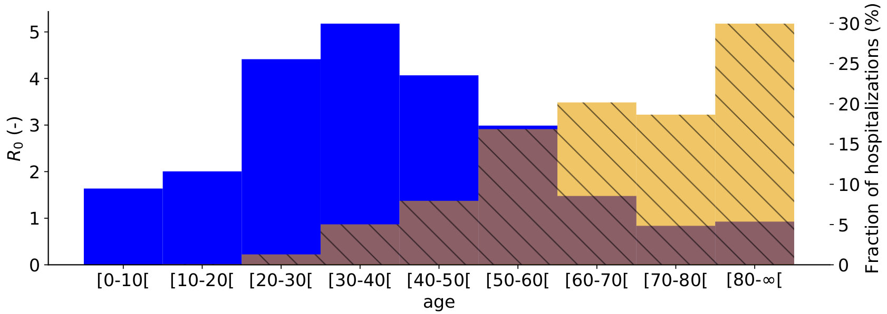

## Previous work

Our COVID-19 modeling and control project has grown rapidly and organically. We have thus reported most of our progress using blog posts on LinkedIn. To get a chronological overview of events, we recommend reading the three blogposts on the profile of prof. Nopens [1, 2, 3]. We first used a simple model to demonstrate that the use of controller algorithms from the chemical industry can aid policymakers by computing social policies that prevent virus spread [1, 2]. We started with a relatively simple implementation of a deterministic SEIRD model. However, to make more accurate predictions, both for modeling COVID-19 spread as for coupling to an economic model, we quickly realized more complex models would be needed [2]. We modified the classical SEIRD dynamics to incorporate more expert knowledge on COVID-19 infection and hospital dynamics. To this end, we performed a rigorous literature review and consulted with physicians from the Ghent University hospital. The severity and spread of the disease depend on the age of the individual, this feature is from hereon referred to as age-stratification. Age-stratified hospitalisation parameters were obtained by analysing data from Ghent university hospital and AZ Maria Midelares (n=370). Next, our models were calibrated to high-level Belgian hospitalization data and the effect of releasing social restrictions was studied. On July 21st, we submitted our first manuscript in epidemiological modeling to *Epidemics*.

### A deterministic, age-stratified, extended SEIRD model for assessing the effect of non-pharmaceutical interventions on SARS-CoV-2 spread in Belgium [4]

#### Parameters governing hospitalizations

First, data from 370 patients, treated in two Ghent (Belgium) hospitals were analysed. The goal was to use the hospitalization parameters as proxies for all Belgian hospitals. This was necessary because the Belgian Scientific Institute of Public Health (Sciensano) refuses to make the hospital dataset publically available. Instead, scientists are forced to sign highly restrictive non-disclosure agreements which restrict free publishing (!).

Even tough sample size was limited, we found estimates in line with peer-reviewed estimates from American and Chinese authors. In the table below, the model parameter $c$, which is the percentage of patients staying in Cohort (thus not needing intensive care), $m_C$, the mortality in Cohort and $m_{\text{ICU}}$ are shown. It can clearly be seen that older individuals have a higher chance of needing intensive care and have a higher chance of dying. From the 27 patients under 40 years old, only 2 needed intensive care and none have died. The average time patients spent in the emergency room, in a Cohort ward or in an ICU were also computed. **Based on the hospital dataset, we concluded that a COVID-19 infection is more severe in older individuals. This highlights the necessity to use age-stratification in our models.**

<em> Computed fraction of hospitalized remaining in Cohort and not transferring to an ICU (c), mortality in Cohort (m_{C}) and mortality in ICU (m_{ICU}) per age group for two Belgian hospitals (n = 370).</em>

#### Basic reproduction number and hospitalisations

The population average basic reproduction number ($R_0$) during the March 2020 COVID-19 epidemic was computed as 2.83 (deterministic) or 3.10 (stochastic), which is in line with the global consensus range of 2-3. Next, the basic reproduction number and expected fraction of the total hospitalisations were computed (see figure below). The basic reproduction number for individuals aged 70 and above is less than one, implying these individuals cannot sustain SARS-CoV-2 transmission amongst themselves. This is mainly because older individuals have, on average, less social contact than younger individuals. In spite, ages 70 and above represent half of the expected hospitalisations. **This indicates that the protection of the elderly may be the most efficient way to reduce
strain on the public health care system in case of another SARS-CoV-2 outbreak.**

<em>Cumulative number of hospitalizations in Belgium from March 15th, 2020 until May 4th, 2020. For all ages (red) and for ages 70 and above (blue).</em>

<em> Basic reproduction number (R0) per age group on May 4th, 2020 (blue). Expected fraction of the total hospitalizations per age group, for Belgium (yellow). </em>

#### Lockdown release

We informed the models contact matrices (governing social interactions) with mobility reductions from the *Google community mobility reports* to model the release of the Belgian lockdown. However, we found that our model drastically overpredicted the expected number of patients in Belgian hospitals. From July 2020 onwards, clusters of COVID-19 infections have become very local in nature, making it difficult to perform forecasting with a national-level model. **The local nature of COVID-19 infection clusters highlight the need for spatially explicit models** (see section on *Future work*). New contact matrices under lockdown measures are being gathered by the group of prof. Niel Hens (UHasselt) and will be used in conjuction with our model.

[1] https://www.linkedin.com/pulse/covid-19-from-model-prediction-predictive-control-ingmar-nopens?trk=portfolio_article-card_title

[2] https://www.linkedin.com/pulse/holistic-decision-support-tool-optimal-lockdown-release-ingmar-nopens?trk=portfolio_article-card_title

[3] https://www.linkedin.com/pulse/holistic-decision-support-tool-optimal-lockdown-release-ingmar-nopens-1f?trk=portfolio_article-card_title 

[4] https://www.medrxiv.org/content/10.1101/2020.07.17.20156034v2