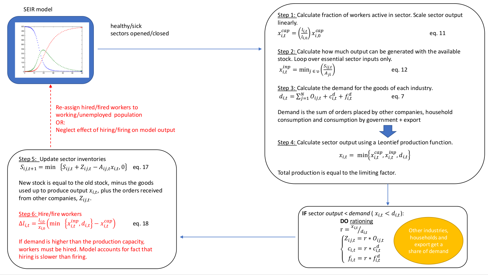

## Future work

### Economic network model

The effects of the virus-related demand shock (consumption) and supply shock (labor) will be used to calculate the effect of COVID-19 spread and of the economic lockdown on the Belgian GDP. The network model computes the maximum sectoral output under demand, stock, and labor constraints. A Leontief production function will be used to constraint sectoral output under the given limitations. However, inspired by the work of Oxford University [1], we will consider if the input is essential for production when constraining sectoral output. As an example, consider a restaurant visit to close a construction deal. In an input-output table, the amount of output from the construction sector will partly depend on restaurants. In times of crisis, the construction sector can attain the same output without restaurants. Next, when output is smaller than demand, rationing will be performed. In the next step, the inventories of every economic sector will be updated and workers will be hired or fired. After this step feedback can be given to the epidemiological model. Even without considering model predictive control, the implementation of the economic network model can be used to 1) compute the approximate costs of the March-May 2020 lockdown as a retrospective analysis, 2) compute the effect of closing certain sectors on both virus spread and the Belgian GDP.

### Spatial extension

Stringent lockdown measures from March 15th to May 4th 2020 resulted in a succesfull flattening of the Belgian hospitalization curve. From July 2020 onwards, clusters of COVID-19 infections in Belgium have become very local in nature, making it hard to make long term predictions on how the number of hospitalizations will evolve in the future. After succesfully analyzing the first (March 2020) COVID-19 wave with our deterministic and stochastic national model, we must now shift our attention to spatially explicit models. To this end, the national model with its extended SEIRD dynamics and hospitalization parameters will be used in conjunction with recurrent commuting data from the 2011 Belgian census [2]. Such *patch model*, inspired by the work of Arenas and Costa [3,4] can be used to make more accurate predictions for Belgium and can be used in conjunction with the MPC controller algorithm to study spatially-explicit containment strategies. 

[1] https://arxiv.org/abs/2005.10585

[2] https://census2011.fgov.be/download/downloads_nl.html

[3] https://www.medrxiv.org/content/10.1101/2020.03.21.20040022v1

[4] https://www.medrxiv.org/content/10.1101/2020.05.06.20093492v2